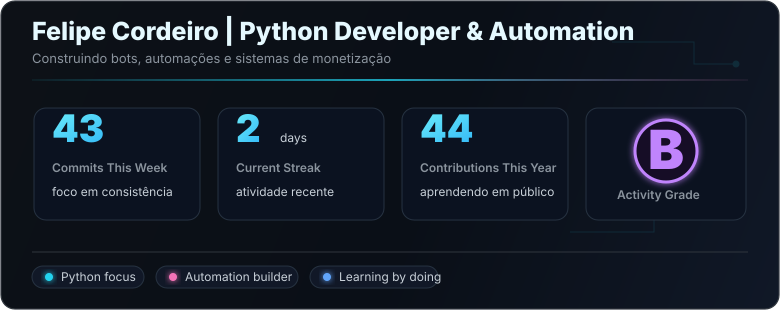
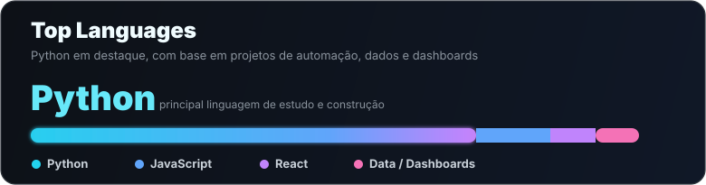

  
    
  
  
  

---

## Sobre Mim

Sou estudante de **Sistemas de Informação** no primeiro semestre.

Estou começando agora na área de programação. Na faculdade estou aprendendo **Java**, e por conta própria estou estudando **Python**, automação e bots.

Este GitHub serve para registrar meus estudos, projetos e evolução.

---

## Projetos Em Destaque

**🔹 [Cyber Home Dashboard](https://github.com/Cordeiro767/cyber-home-dashboard)**  
Um dashboard simples para monitoramento de rede doméstica.

- Tecnologias usadas: FastAPI, SQLite, WebSockets
- Status: Em desenvolvimento

---

**🔹 [Revenue Vision](https://github.com/Cordeiro767/revenue-vision)**  
Projeto de análise de dados e dashboards.

- Tecnologias usadas: Streamlit, Pandas, Plotly
- Status: Em andamento

---

## O que estou aprendendo

| Área | Tecnologias / Assuntos |
|---|---|
| Backend | Java (faculdade), Python, FastAPI |
| Dados | Pandas, Plotly, Streamlit |
| Automação | Bots no Telegram, automações básicas |
| Outros | Git, GitHub, SQLite |

---

## GitHub Stats

<table>
  <tr>
    <td width="72%" valign="top">
      
    </td>
    <td width="28%" align="center" valign="middle">
      
       
      Modo Construtor
    </td>
  </tr>
</table>

  

---

## Skills (em aprendizado)

  

---

  Registrando minha evolução • Primeiro semestre de SI

