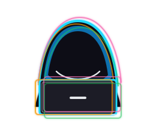

  
  
  
  

---

## Sobre Mim

<table>
  <tr>
    <td width="68%" valign="top">
      <h3>Aprendendo desenvolvimento construindo projetos reais.</h3>
      

        Sou estudante de Sistemas de Informação, iniciante em desenvolvimento, e estou usando projetos práticos
        para evoluir em software, automação, IA aplicada e análise de dados.
      

      

        Meu foco agora é aprender de verdade: construir, errar, melhorar e transformar curiosidade em ferramentas
        cada vez mais claras, úteis e bem apresentadas.
      

    </td>
    <td width="32%" valign="top">
      <h3>Direção</h3>
      

        <code>Aprendizado prático</code>
        <code>Projetos reais</code>
        <code>Automação</code>
        <code>IA aplicada</code>
        <code>Dashboards</code>
        <code>Análise de dados</code>
        <code>UX/UI</code>
      

    </td>
  </tr>
</table>

---

## Projetos Em Destaque

<table>
  <tr>
    <td width="100%" valign="top">
      <h2><a href="https://github.com/Cordeiro767/cyber-home-dashboard">Cyber Home Dashboard</a></h2>
      
<b>Meu principal projeto técnico até agora.</b>

      

        Monitoramento de rede doméstica com descoberta automática de dispositivos, histórico e dashboard visual.
      

      
<b>Por que estou construindo:</b> para aprender backend, tempo real, persistência de dados e conceitos práticos de redes em um projeto completo.

      
<b>O que estou aprendendo:</b>

      <ul>
        <li>FastAPI</li>
        <li>SQLite</li>
        <li>WebSockets</li>
        <li>arquitetura backend</li>
        <li>conceitos de redes</li>
      </ul>
      

        
        
      

    </td>
  </tr>
</table>

<table>
  <tr>
    <td width="100%" valign="top">
      <h2><a href="https://github.com/Cordeiro767/revenue-vision">Revenue Vision</a></h2>
      
<b>Meu principal projeto de produto e negócios.</b>

      

        Plataforma de análise comercial criada para transformar dados operacionais em relatórios e ferramentas úteis para negócios.
      

      
<b>Por que estou construindo:</b> para aprender dashboards, visualização de dados, UX, análise comercial e organização de um produto em módulos.

      
<b>O que estou aprendendo:</b>

      <ul>
        <li>Streamlit</li>
        <li>Pandas</li>
        <li>Plotly</li>
        <li>design de produto</li>
      </ul>
      
<b>Estrutura:</b> Analytics, Dashboards, Relatórios, Insights e FlowPay como módulo interno de contas a pagar.

      

        
        
      

    </td>
  </tr>
</table>

## Aprendendo Agora

<table>
  <tr>
    <td width="25%" align="center"><b>Backend</b> APIs, banco e arquitetura</td>
    <td width="25%" align="center"><b>Dados</b> Revenue Vision</td>
    <td width="25%" align="center"><b>Produto</b> FlowPay dentro do Revenue Vision</td>
    <td width="25%" align="center"><b>Automação</b> resolver trabalho manual</td>
  </tr>
</table>

---

## GitHub Stats

<table>
  <tr>
    <td width="70%" valign="top">
      
       
      
    </td>
    <td width="30%" align="center" valign="middle">
      
      
Modo Construtor

    </td>
  </tr>
</table>

  

---

## Skills

  

  <code>Python</code>
  <code>JavaScript</code>
  <code>React</code>
  <code>Next.js</code>
  <code>FastAPI</code>
  <code>SQLite</code>
  <code>Automation</code>
  <code>Dashboards</code>

---

## GitHub Trophies

  

---

  Aprendendo em público, construindo projetos reais e evoluindo continuamente.

